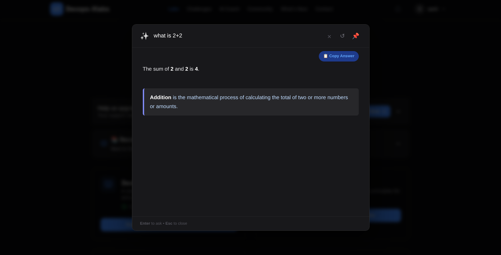

# ⚡ Lazy AI

**A personal AI overlay for staying in flow.**

Preview:

##  Context

I realized that **switching tabs kills momentum.**

Every time I was studying or coding and needed to ask an AI a question, I had to:
1. Stop what I was doing.
2. Open a new tab.
3. Go to ChatGPT or Gemini.
4. Ask some question.
5. Read the answer.
6. Switch back and try to remember where I left off.

**Lazy AI** solves this. It is a keyboard-first overlay that brings the smartest AI (Gemini 3) directly *on top* of whatever you are reading. You never leave your current page, you never lose your context, and you never break your flow.

I built this for my own workflow. I'm open-sourcing it so you can use it, break it, or improve it.

---

## 🧐 Architecture & Philosophy

Browser-based AI tools (Copilot, Gemini Sidebar) are convenient but have trade-offs I didn't want:

1.  **Data Isolation:** Most browser AIs sync chat history to the cloud. This tool saves history exclusively to `chrome.storage.local`. Your data never leaves your machine except to hit the API.
2.  **Model Control:** Free tiers often default to faster, dumber models. This tool forces the use of **Gemini 3 Preview** (or 2.5) via your own API keys.
3.  **Security:** Standard extensions often ask you to paste API keys into the browser, exposing them to potential scraping. This project uses a **Cloudflare Worker** to hold keys, so the client-side code never sees them.

---

## ⚙️ The "Multi-Key" Load Balancer

Google's Generative AI free tier limits requests per minute **per Project**, not just per account.

To handle heavy bursts of usage (like studying or debugging), this backend implements a simple round-robin rotator:
* You provide up to 5 API keys (from 5 separate Google Cloud Projects).
* The Worker cycles through them for every request.
* **Benefit:** This effectively multiplies the standard rate limit by 5x, preventing "429 Too Many Requests" errors during rapid use.

---

##  Setup (Self-Hosted)

You control the entire stack. No servers, no tracking.

### Phase 1: API Keys
To bypass standard rate limits, you need distinct projects.
1.  Go to [Google AI Studio](https://aistudio.google.com/app/apikey).
2.  Create a key. **Important:** Select **"Create API key in a NEW project"** for each key.
3.  Repeat 3-5 times.
    * *Technical Note:* Sharing one project across 5 keys does not increase your quota. Distinct projects are required for the load balancer to work effectively.

### Phase 2: Backend (Cloudflare)
1.  Create a free [Cloudflare Worker](https://workers.cloudflare.com/).
2.  Paste the code from `worker.js`.
3.  In Worker Settings → Variables, add your keys: `GEMINI_KEY_1`, `GEMINI_KEY_2`, etc.
4.  Deploy and copy the URL.

### Phase 3: Frontend (Extension)
1.  Clone this repo.
2.  In `background.js`, set `const WORKER_URL` to your Cloudflare URL.
3.  Load unpacked in `chrome://extensions`.
4.  **Refresh your tabs** to inject the content script.

---

## ⌨️ Shortcuts

| Shortcut | Action |
| :--- | :--- |
| **Ctrl + Shift + Y** | Toggle Overlay |
| **Esc** | Close (clicking  outside modal also closes) |
| **Up / Down** | History Nav |

---

##  Contributing

This is a personal tool I use daily. It works for me, but it might not work for everyone.

* Found a bug? Open an Issue.
* Want to add a feature? Fork it and submit a Pull Request.
* Have a better UI idea? Let's see it.

## 📄 License
MIT.